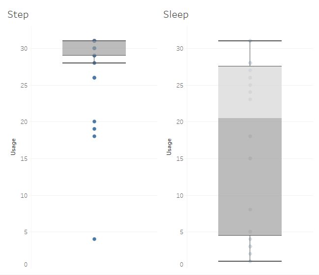
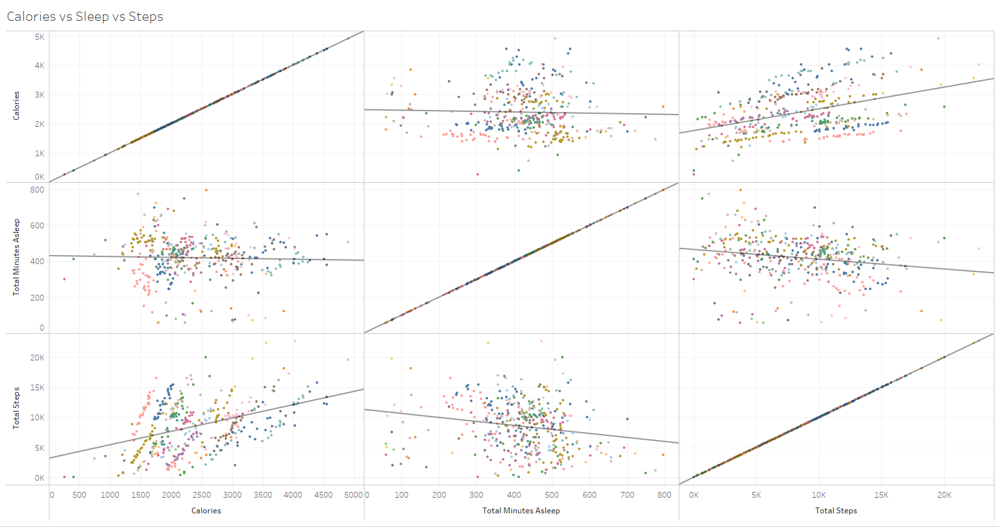
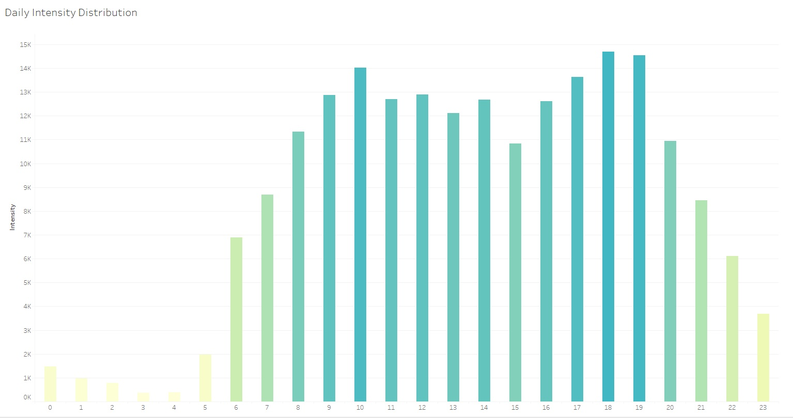
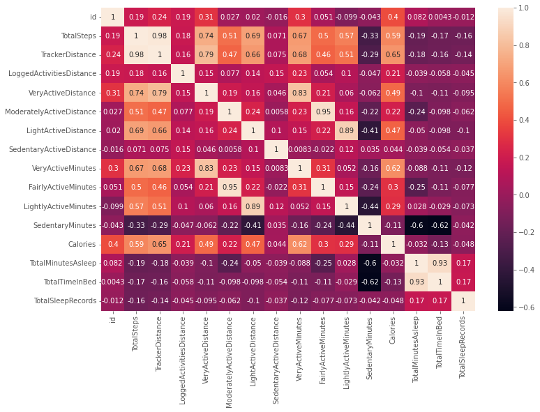
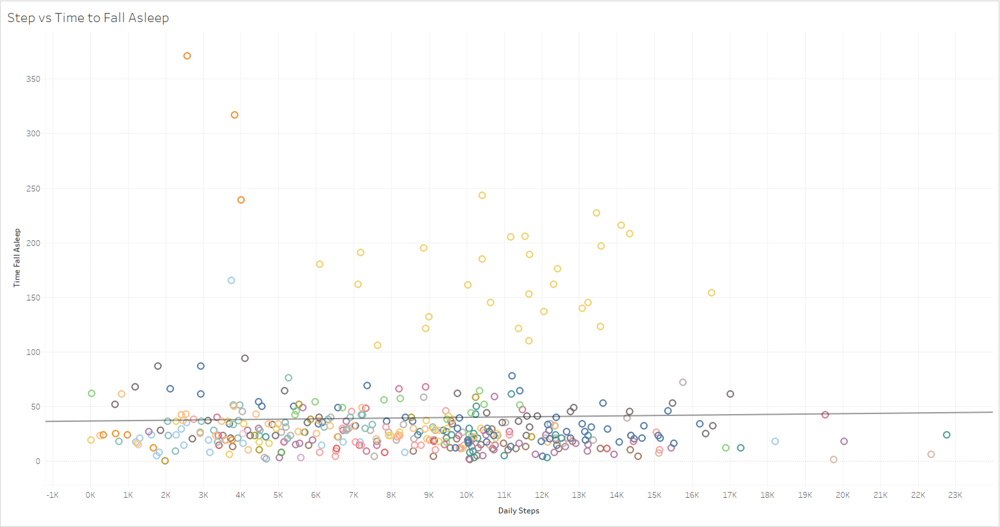

## Table of Content
- [1. Summary](#1)
- [2. Ask](#2)
- [3. Prepare](#3)
  -[3.1 Dataset used](#3.1)
  -[3.2 Accessibility and privacy of data](#3.2)
  -[3.3 Information about dataset](#3.3)
  -[3.4 Data Organizasion and verification](#3.4)
  -[3.5 Data credibility and intergrity](#3.5)
- [4. Process](#4)
  -[4.1 Import dataset](#4.1)
  -[4.2 Cleaning and formatting](#4.2)
    -[4.2.1 Date formatting](#4.2.1)
    -[4.2.2 Duplicates handelling](#4.2.2)
    -[4.2.3 Removing nessesery data](#4.2.3)
    -[4.2.4 Heart Rate dataset](#4.2.4)
- [5. Analyse and share](#5)
  -[5.1 Device usage](#5.1)
  -[5.2 Calories vs Sleeps vs Steps](#5.2)
  -[5.3 Active level](#5.3)
  -[5.4 Intensity in a day](#5.4)
  -[5.5 Correlations](#5.5)
  -[5.6 Time to fall asleep](#5.6)
- [6. Act](#6)

 

# 1. Summary 🎈
Bellabeat, a high-tech manufacturer of health-focused products for women. Bellabeat is a successful small company, but they have the potential to become a larger player in the global smart device market. In this case study, I will focus on a single Bellabeat's product, <strong>Leaf</strong>,  and analyse the smart device dataset to gain insight into how consumers are using their smart devices.

Leaf is Bellabeat's classic wellness tracker can be worn as a bracelet, necklace, or clip. The Leaf tracker connects to the Bellabeat app and has features:
- Tracks user's activity, and send reminders.
- Tracks user's menstrual cycle.
- Tracks user's meditations and sleep habits.
- Tracks user's stress resistance.

 

# 2. Ask 🔍

## 2.1 Business task
- What are some trends in smart device usage?
- How could these trends apply to Bellabeat customers?
- How could these trends help influence Bellabeat marketing strategy?

## 2.2 Stakeholders
- <strong>Urška Sršen</strong>: Bellabeat’s cofounder and Chief Creative Officer.
- <strong>Sando Mur</strong>: Mathematician and Bellabeat’s cofounder; key member of the Bellabeat executive team.
- <strong>Bellabeat marketing analytics team</strong>: A team of data analysts responsible for collecting, analyzing, and reporting data that helps guide Bellabeat’s marketing strategy. You joined this team six months ago and have been busy learning about Bellabeat’’s mission and business goals — as well as how you, as a junior data analyst, can help Bellabeat achieve them.
 

# 3. Prepare 🎨

## 3.1 Dataset used
The dataset used for this case study is FitBit Fitness Tracker Data from Mobius on Kaggle.

## 3.2 Accessibility and privacy of data
We can determine from the source website of the data, that this is an open source dataset. Under copyright law, we can copy, modify, distribute and perform works, even for commercial purposes, without asking permission. Provided the owner waives all his or her worldwide rights to the work to the extent permitted by law, thereby placing the work in the field of publication.

## 3.3 Information about dataset
These datasets were generated from a survey of 30 respondents conducted via Amazon Mechanical Turk between December 3, 2016 and December 5, 2016. Thirty eligible Fitbit users agreed to submit personal tracker data, including minute-by-minute output of physical activity, heart rate and sleep monitoring. Differences between outputs indicate use of different types of Fitbit trackers and individual tracking behavior/preferences.

## 3.4 Data Organizasion and verification
There are 18 CSV files in the dataset. Each file contains different data tracked by FitBit. The data is considered long, because each row is one time point for each consumer. Hence, each consumer will have data in multiple rows. For each user, there is a unique ID and different rows since data is tracked by day and time.

| Table Name                         | Type | Number of Users | Duration/day | Description                                                                                         |
|--------------------------------|------|-----------------|--------------|-----------------------------------------------------------------------------------------------------|
| dailyActivity_merged           | CSV | 33              | 31           | Tracking daily: steps, distance, intensity, and calories.                                           |
| dailyCalories_merged           | CSV | 33              | 31           | Tracking daily: calories.                                                                           |
| dailyIntensities_merged        | CSV | 33              | 31           | Tracking daily: time and distance of sedentary, lightly activity, fairly active, very active state. |
| dailySteps_merged              | CSV | 33              | 31           | Traking daily: steps.                                                                               |
| heartrate_seconds_merged       | CSV | 7               | 31          | Tracking: heart rate every 10 to 15 secends.                                                        |
| hourlyCalories_merged          | CSV | 33              | 31           | Tracking hourly: calories.                                                                          |
| hourlyIntensities_merged       | CSV | 33              | 31           | Tracking hourly: intensity.                                                                         |
| hourlySteps_merged             | CSV | 33              | 31           | Tracking hourly: steps.                                                                             |
| minuteCaloriesNarrow_merged    | CSV | 27              | 31          | Tracking minutely: calories. Each row is a minute.                                                  |
| minuteCaloriesWide_merged      | CSV | 33              | 31         | Tracking minutely: calories. Each row is an hour, and 60 columns for each minute.                   |
| minuteIntensitiesNarrow_merged | CSV | 27              | 31          | Tracking minutely: intensity. Each row is a minute.                                                 |
| minuteIntensitiesWide_merged   | CSV | 33              | 31          | Tracking minutely: intensity. Each row is an hour, and 60 columns for each minute.                  |
| minuteMETsNarrow_merged        | CSV | 27              | 31           | Tracking minutely: metabolic equivalent.                                                            |
| minuteSleep_merged             | CSV | 24              | 31          | Tracking minutely: value indicating the sleep state. 1 = asleep, 2 = restless, 3 = awake, and logId |
| minuteStepsNarrow_merged       | CSV | 27              | 31           | Tracking minutely: steps.                                                                           |
| minuteStepsWide_merged         | CSV | 33              | 31       | Tracking minutely: steps. Each row is an hour, and 60 columns for each minute.                      |
| sleepDay_merged                | CSV | 24              | 31          | Tracking daily: total sleep records, minutes asleep, time in bed.                                   |
| weightLogInfo_merged           | CSV | 8               | 31         | Tracking daily: weight, body fat percent, BMI, report type, logId.                                  |

 

## 3.5 Data credibility and intergrity
Since this set of data comes from a maximum of 33 users, we may run into sampling bias issues, and we are not sure that the samples in the data are representative of the entire general population. Another problem is that this set of data is basically based on one month's data. We can imagine a scenario where, say in winter, people find it difficult (for some) to get up early because of the low temperatures. During summer, we may (for some) become less active due to warmer temperatures, so time period constraints may also lead to gaps in our analysis results from the general truth.

# 4 Process 🛠
For this case study, I will use Microsoft excel and Microsoft SQL server to cleaning, analyse data. Then, create data visulasation using tableau to share my insight learnt from dataset to the stakeholders.

## 4.1 Import dataset
First, I convert CSV file to XLSX file to suit the import requirement of MS SQL server. 

## 4.2 Cleaning and formatting

### 4.2.1 Date formatting
For some reason, there is a part of date format over 18 files are string, which can cause a lot misleading. The image shows almost what is happen in all files. The top three rows are the date in the correct format, they could be transfer of format to different date type. However, the bottom 5 are in the text string format, which make them unconvertable. Because of the AM/PM at the end, function "Text to Columns" cannot recognize the cell. Hence, I separete them in to date and time, then convert them and combine the converted date and time to fix the date format issue.

### 4.2.2 Duplicates handelling
In this case study, I considered that a file has more than 1 record when the id and datetime is the same is duplicated. There are 2 files with duplicates. The first one is minuteSleep_merged file, user id 4702921684's information has been collected twice, this may because that this user have two deviced that record he/her stats at the same time. Hence, we created a new file minuteSleep_new_merged which maintain only non-duplicate record. The second file is sleepDay_merged, there are three records has been showns twice in the dataset, I filtered them out by creating a new file sleepDay_merged.
 

There are two columns in dailyActivity_merged dataset, TotalDistance and TrackerDistance. According to the fitabase data dictionary, TotalDistance is the total kilometres tracked (assume this is provide by the user's non-fitbit device, e.g. phone), TrackerDistance is the total kilometres tracked by Fitbit device. By checking the repeatability of these two column, there are only three record that have different value of TotalDistance and TrackerDistance, and the TotalDistance are always greater than the TrackerDistance. At the end, I droped the TotalDistance columns for a more compact dataset.

### 4.2.3 Removing nessesery data
In the dataset, there are two different ways of recording calories, intensity and steps in minute. They were called "wide" and "narrow". However, they are basicly holding the same data, the only differece is the data structure (as the table in 3.4 shown). Hence, I deviced to keep all the "narrow" dataset, and drop all the "wide" dataset.

### 4.2.4 Heart Rate dataset
heartrate_seconds_merged dataset with three attribute: id, date (accurate to the second) and value, and totally 1.04 million rows. It contains the users' heart rate in seconds, however, all other dataset are measured in minutes or hours or days. There is no point to be that accuracte for this case study. Hence, I create another file heartrate_minutes_merged to with the users' heart rate in minutes, and take the average of heart rate in a minute to calculate the new heart rate value. There are two main reason of this process:
- Decrease the data size from 1.04 million rows to 121 hundred rows.
- Able to combine with other dataset easily.
 

# 5. Analyse and share🔮

## 5.1 Device usage

Dataset for this case study are collected from consumers of FitBit. Hence, it is important to know the device usage of consumers.

As the image shows, consumers are more likely to trede their smart device as a step recording device. Amount 33 users, there are 22 users used the device to record their steps, but only 3 user checked their sleep everyday (median at 20.5).

## 5.2 Calories vs Sleeps vs Steps

This image shows there is a slightly negative relation between daily steps and time asleep, calories and steps has a positive relation, and there is no relation between sleep and calories. Each colour represents each consumers.

## 5.3 Active level

As the pie chart shows, users spend aproximately 1 thousand minutes, which is 16.6 hours, at sedentary on average. But only 21.2 minutes of exercise per day on average.

## 5.4 Intensity in a day

As the bar chart shows, consumers have more intensity at 10AM, 5~7PM than other time in a day.

## 5.5 Correlations

This heatmap shows the correlations between each feature of consumers.

## 5.6 Time to fall asleep

In this image, each colour represents each consumers. As we can see, some of the users take above an hour to fall asleep. Under normal circumstances, it takes more than 15 minutes for a person to fall asleep. 

# 6. Act

Firstly, I would highly recommend Bellabeat to collect there own data for analysing no matter from the app or other sport device. Each company has their own characteristics. As a company which focus on women health, we need to show more about our focus. 

Recommendations:

1. Create an interactive system between users, such as adding friends and viewing friends' steps and schedules. Because people often want to show their better side in everyone's field of vision.

2. Afterwards, a reward mechanism can be introduced to encourage users to record their daily sleep conditions, such as when to go to bed or when to get up, to help users develop good work and rest habits. The way of reward can be a voucher for purchasing Bellabeat products, or an analysis report from a health expert.

3. Through the observation of the time to fall asleep, we found that some users will not fall asleep until several hours later, we speculate that the users may be watching TV or playing with mobile phones before going to bed. This strong message keeps our brains active, making it harder to fall asleep and affecting how we feel the next day. So the Bellabeat team can send a silent push on the phone when it detects that the user is in bed at night but hasn't fallen asleep for half an hour: "Dear xxx, it's time to go to bed."

4. When the user is detected to be sitting for a long time, the vibrating leaf reminds the user to stand up and move around.

