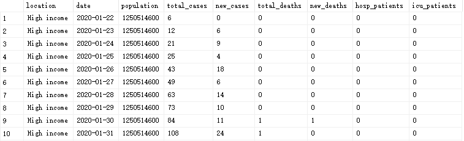
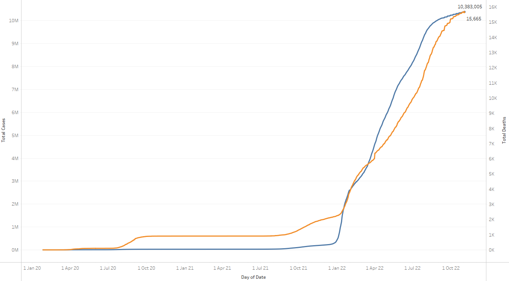
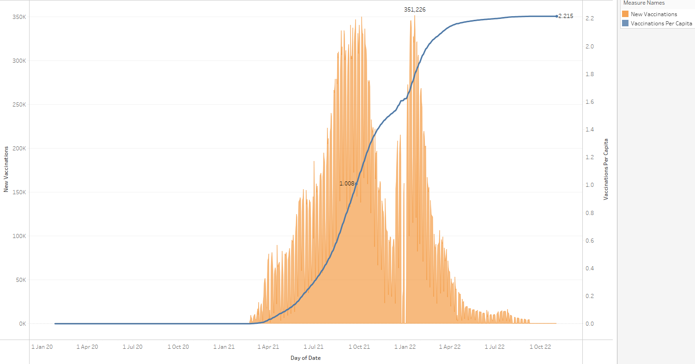

## Table of Contents
- [1. Summary](#1)
- [2. Ask](#2)
- [3. Prepare](#3)
  - [3.1 Dataset used](#3.1)
  - [3.2 Accessibility and privacy of data](#3.2)
  - [3.3 Information about dataset](#3.3)
  - [3.4 Data organization and verification](#3.4)
  - [3.5 Data credibility and intergrity](#3.5)
- [4. Process](#4)
  - [4.1 Import dataset](#4.1)
  - [4.2 Data cleaning](#4.2)
- [5. Analyse and Share](#5)
  - [5.1 Global numbers](#5.1)
  - [5.2 Determining the severity of the virus](#5.2)
  - [5.3 The country has the most infected people](#5.3)
  - [5.4 Top 5 countries have highest death rate](#5.4)
  - [5.5 In Australia](#5.5)
  
 

# 1.Summary 📚
Covid-19 is an infectious disease caused by the SAR-CoV-2 virus. Most people infected with this virus will experience mild to moderate respiratory illness, but some may become severely ill and require medical care. And anyone, at any age, can get sick, become seriously ill, and die.The disease first broke out at the end of 2019, and then spread rapidly to many countries around the world in 2020, gradually turning into a global pandemic.

The focus of this case is to organize the raw data set and analyze the development trend of the new coronavirus and the later vaccine response measures in the whole world.

 

# 2. Ask 🤔
Identify trends in covid-19

 

# 3. Prepare 🌱

## 3.1 Dataset Used 
The dataset used for this case study is Covid-19 deaths dataset. This dataset is from Our World in Data (OWID), which is a scientific online publication that focus on large global problems such as poverty, disease, hunger, climate change, was, existential rishs, and inequality.

## 3.2 Accessibility and privacy of data
We can determine from the source website of the data, OWID, that this is an open source dataset. Under copyright law, we can copy, modify, distribute and perform works, even for commercial purposes, without asking permission. Provided the owner waives all his or her worldwide rights to the work to the extent permitted by law, thereby placing the work in the field of publication.

## 3.3 Information about dataset
This dataset records data about the Covid-19 from February 4, 2020 to the present. This dataset was provided to OWID by experts in the field Edouard Mathieu, Hannah Ritchie, Lucas Rodés-Guirao, Cameron Appel, Daniel Gavrilov, Charlie Giattino, Joe Hasell, Bobbie Macdonald, Saloni Dattani, Diana Beltekian, Esteban Ortiz-Ospina, and Max Roser organization and it is updated daily.

## 3.4 Data organization and verification
The dataset for this case study is a CSV file. The data is considered long since each row is one time point per country or area, hence, each country or are will have data in multiple rows. Then, the dataset has been separeated in to two files, Deaths and Vaccine, for the convenience of exploring their individual trends.

| Table Name | Type | Description | Columns Example |
| --- | --- | --- | --- |
| CovidDeaths | xlsx | Data of deaths due to Covid-19 globally | Location, Date, Population, Cases, Deaths |
| CovidVaccinations | xlsx | Data of vaccinations of Covid-19 globally | Location, Date, Population, Vaccinations |
| CovidData | xlsx | Combination of above two |  |

## 3.5 Data credibility and intergrity
The reliability and completeness of this database are relatively high, except for some countries or regions where data is missing or updated at different times than others (data for most countries is updated daily). This can be. It may cause the analysis results or the process of virus spread to have slightly deviated from the real results, but overall this is a very complete dataset.

 

# 4. Process📽
In this case study, Microsoft SQL Server is used for data clearning and make view for visuallsation in tableau.

## 4.1 Import dataset
Load two xlsx files in to MS SQL Server

## 4.2 Data cleaning
### 4.2.1 Check duplicates
https://github.com/Heatescape/PortfolioProjects/blob/6a6e0e5bb5b12abc858750f3409d3626ab671df5/Covid-19/SQL_Query/DataCleaning.sql#L6-L9

Result: No duplicates found by grouping location and date

### 4.2.2 Check missing data
https://github.com/Heatescape/PortfolioProjects/blob/6a6e0e5bb5b12abc858750f3409d3626ab671df5/Covid-19/SQL_Query/DataCleaning.sql#L12-L16

Result: 

From a quick peek of the dataset, I found out that there is a significant number of nulls, mainly in cases and deaths column. Then I realise that is because there is no cases or deaths in those countries or areas. Hence, I will keep those nulls, and trade them as zero if nessesary. This image shows the last date of "no case" using the maximum of the date where the cases is null.

https://github.com/Heatescape/PortfolioProjects/blob/6a6e0e5bb5b12abc858750f3409d3626ab671df5/Covid-19/SQL_Query/DataCleaning.sql#L18-L20

Result:
By filtering rows that have continent value of null, we can tell that this is different type of separation other then country.

To in case I did not miss some "real nulls", I checked null values of total_cases and total_deaths after November 2022.

https://github.com/Heatescape/PortfolioProjects/blob/811d87250188c9e7366ac4b75e0aede941b49816/Covid-19/SQL_Query/cleaning.sql#L18-L22

The output are mainly from Grate Britain, and North Korea. It causes confuse and by further research, Britain does have covid badly. Hence I decided to filter out information from those areas.

### 4.2.3 Data format

#### 4.2.3.1 Date format

The date format in this dataset is datetime (yyyy-mm-dd hh:mm:ss.msmsms), however most countries and areas update their data once a day, and also in this case study, we do not need to sepecify the date in to hours or minutes. Hence, cast(date as date) is used for converting datetime into date.

#### 4.2.3.2 Incorrect format

The original data type of columns including total_deaths, new_deaths, icu_patients, etc. are nvchar. That causes a problem that it cannot be converted from string to numeric value, because, I kept the null value. Hence, I update the dataset for columns except continent, change null to 0. Then, convert them into float datatype for futher calculation.

### 4.2.4 Drop irrelevant data
There is more than one division system in this dataset as I mentioned last point, hence, we better separate them to avoid misunderstanding or confusion.

#### 4.2.4.1 Country aspect
https://github.com/Heatescape/PortfolioProjects/blob/6a6e0e5bb5b12abc858750f3409d3626ab671df5/Covid-19/SQL_Query/DataCleaning.sql#L24-L27

#### 4.2.4.2 Continent aspect
https://github.com/Heatescape/PortfolioProjects/blob/6a6e0e5bb5b12abc858750f3409d3626ab671df5/Covid-19/SQL_Query/DataCleaning.sql#L37-L44

#### 4.2.4.3 Income aspect
https://github.com/Heatescape/PortfolioProjects/blob/6a6e0e5bb5b12abc858750f3409d3626ab671df5/Covid-19/SQL_Query/DataCleaning.sql#L30-L34

 

# 5. Analyse🔬

## 5.1 Global numbers
https://github.com/Heatescape/PortfolioProjects/blob/4737c604d011c5f4b72702fd579cec4af4784052/Covid-19/SQL_Query/Analyse.sql#L56-L58

Until 02/11/2022, there are 640 million Covid-19 cases around the world and causes 6.7 million of deaths, hence the death rate is 1.048%.

## 5.2 Determining the severity of the virus

### 5.2.1 Based on the infected percentage in country
https://github.com/Heatescape/PortfolioProjects/blob/4737c604d011c5f4b72702fd579cec4af4784052/Covid-19/SQL_Query/Analyse.sql#L8-L14

Cyprus has the highest infected rate of 66.86%.

### 5.2.2 Based on the infected percentage in continent
https://github.com/Heatescape/PortfolioProjects/blob/4737c604d011c5f4b72702fd579cec4af4784052/Covid-19/SQL_Query/Analyse.sql#L17-L23

Europe is the continent that has the highest infected rate of 31.76%, Oceania is the second with 28.03%.

### 5.3 The country has the most infected people
https://github.com/Heatescape/PortfolioProjects/blob/4737c604d011c5f4b72702fd579cec4af4784052/Covid-19/SQL_Query/Analyse.sql#L44-L47

The United States has 97.6 million people infected by Covid-19, which is the country has the most infected people.

### 5.4 Top 5 countries have highest death rate
https://github.com/Heatescape/PortfolioProjects/blob/4737c604d011c5f4b72702fd579cec4af4784052/Covid-19/SQL_Query/Analyse.sql#L50-L53

Yemen has the highest death rate of approximately 18% following by Sudan, Syria, Peru and Somalia.

### 5.5 In Australia

#### 5.5.1 Total cases and deaths since Covid-19 began

From the beginning of covid until January 2022, the number of infections and deaths in Australia has been relatively flat, except for a small increase in the number of infections in September 2020. Starting from January 2022, the total number of infections and deaths in Australia has increased significantly, until now on November 2, 2022, the total number of infections has reached 10 million, and the total number of deaths has exceeded 15,000. From this chart, we can see that in Australia, the growth trend of the number of infections is almost equal to the growth trend of the number of deaths. There are two reasons that may lead to this situation: 1. The Australian people have not actively cooperated with the implementation of the vaccine project. 2. Australia's vaccines are not effective enough.

#### 5.5.2 New cases and deaths since Covid-19 began

This image shows the daily number of new infections and deaths in Australia since the beginning of covid until now (February 11, 2022). From the picture we can see some interesting phenomena. On January 12, 2022, the number of new daily infections in Australia peaked at 175,000, and in the following half a month, the daily number of new deaths began to increase. On April 5, 2022, the daily newly infected population ushered in a small peak of 75,000 people, and then the number of deaths began to increase and reached a local peak a month later. The same thing will happen in July and August 2022. It can be seen from this that, under normal circumstances, the increase in the number of deaths will reach a local high point nearly a month after the latest round of increase in the number of infections, and then decline slightly.

#### 5.5.3 Vaccination progress

This image shows a graph of daily new infections and new vaccines during covid-19 in Australia. It can be seen from the picture that from March 2021, Australians have started to vaccinate. Until the end of 2021, every Australian has received one dose of vaccine on average. In Australia, after receiving the first dose of vaccine, people will receive a text message about three months later that they can continue to receive the second dose of vaccine. As the picture shows, in February 2022, Australia ushered in the first Two vaccination peaks. Up to 350 thousand doses of vaccine per day. Then in April 2022, the number of vaccinations per capita in Australia will reach 2. The final value will be more than two. I think there may be two reasons. First, in Australia, no matter whether they are Australian citizens, they have the right to be vaccinated, so some overseas personnel have also been vaccinated in Australia (such as myself), and second, Australia has recently begun to send out the third dose of vaccine news, but it may be because people's vigilance against covid-19 has declined, so not many people go to get the third dose.

